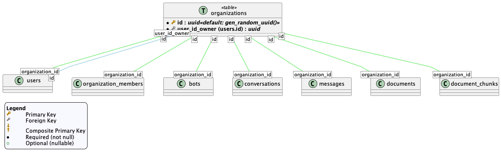
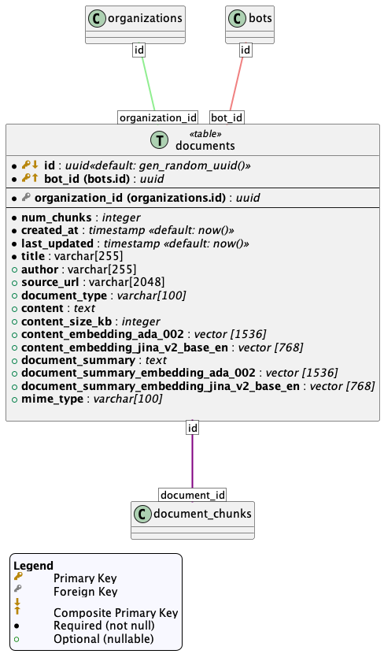
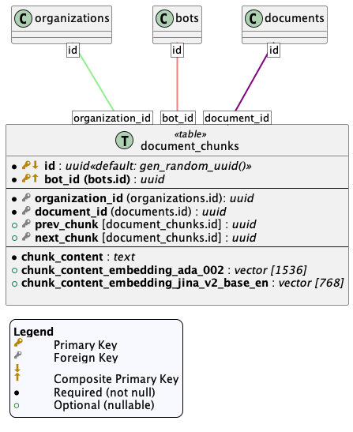

# Table of Contents

- [Table of Contents](#table-of-contents)
- [Introduction](#introduction)
  - [Supabase](#supabase)
  - [Postgres Functions](#postgres-functions)
  - [Inference/Embedding Server](#inferenceembedding-server)
  - [Edge Function HTTP API](#edge-function-http-api)
    - [Authentication](#authentication)
    - [Making Requests](#making-requests)
- [Getting Started](#getting-started)
  - [Supabase setup/configuration](#supabase-setupconfiguration)
  - [Using the Lobby Data API](#using-the-lobby-data-api)
  - [Additional Notes on the Post Messages Request](#additional-notes-on-the-post-messages-request)
- [Lobby Data System Overview](#lobby-data-system-overview)
  - [Relationships and Interactions](#relationships-and-interactions)
  - [Complete Data System Diagram](#complete-data-system-diagram)
  - [Users and Organizations](#users-and-organizations)
    - [Users:](#users)
    - [Organizations](#organizations)
    - [Organization Members](#organization-members)
  - [Document Data Storage \& Bot Configurations](#document-data-storage--bot-configurations)
    - [Bots](#bots)
    - [Documents](#documents)
    - [Document Chunks](#document-chunks)
    - [Bot Documents](#bot-documents)
  - [Conversation Data Storage](#conversation-data-storage)
    - [Conversations](#conversations)
    - [Messages](#messages)


# Introduction

## Supabase
The Lobby Data System uses Supabase, a Backend-as-a-Service alternative to products like Firebase, for hosting and data storage. The purpose of this system is to facilitate seamless conversations between users and bots, and to ensure the safe and efficient storage of these interactions.

The system uses Supabase's included Postgres database on top of which is built a comprehensive data schema. The data schema has been structured to include an array of tables pertinent to the system's functionality, such as organizations, bots, documents, document chunks, users, conversations, messages, and organization members. This schema has been carefully designed to ensure a stable data model for our system.

## Postgres Functions
To maintain the integrity of the data in the actual data schema tables, we've implemented a layer of postgres functions which handle data intensive tasks and have checks/constaints in order to maintain data table consistency.

## Inference/Embedding Server
The System is supported by Lobby's own Inference server. This server has endpoints for both text generation and text embedding tasks. An environment variable needs to be set as part of the Supabase deployment in order for the system to access the Inference server.

## Edge Function HTTP API
The Supabase Edge Function API (JS/Deno) included with the system is an essential component. It provides an HTTP interface for performing various functions, such as creating, updating, and retrieving users and organizations, and managing conversations.

Authentication for the Edge Function API is handled using the built-in Supabase API authentication. The service role API key provided by Supabase is used to access the Edge Function endpoints and is included in the Authentication header.


### Authentication

The Lobby Data API uses API keys for authentication. Visit the Supabase dashboard to retrieve the Service_Role_API_KEY 
[https://supabase.com/dashboard/project/<project_id>/settings/api](https://supabase.com/dashboard/project/<project_id>/settings/api)

**The Supabase Service Role API Key is a secret!** Do not share the key, expose it in client-side code. Request to the API must be routed through your own backend server or any environment where the API key can be securely loaded from an environment variable or key management service.

All API requests must include the Supabase service role key in an `Authorization` HTTP header as follows:

```
Authorization: Bearer YOUR_API_KEY
```

### Making Requests

HTTP Requests are made to the system using this base route:

`https://<project_id>.supabase.co`

The Supabase project url can be found here:
[https://supabase.com/dashboard/project/<project_id>/settings/api](https://supabase.com/dashboard/project/<project_id>/settings/api)

Or by navigating to the project from the dashboard:
https://supabase.com/dashboard

An example curl request would look like this:

Example curl command:
```bash
curl --location -g --request GET 'https://<project_id>.supabase.co/functions/v1/data-api/v1/organizations' \
--header 'Authorization: Bearer {{SUPABASE_SERVICE_ROLE_KEY}}'
```

Example with Javascript:
```javascript
var myHeaders = new Headers();
myHeaders.append("Authorization", "Bearer {{SUPABASE_SERVICE_ROLE_KEY}}");

var requestOptions = {
    method: 'GET',
    headers: myHeaders,
    redirect: 'follow'
};

fetch("https://<project_id>.supabase.co/functions/v1/data-api/v1/organizations", requestOptions)
    .then(response => response.text())
    .then(result => console.log(result))
    .catch(error => console.log('error', error));
```
# Getting Started

## Supabase setup/configuration
1. Create supabase account
2. Create new project (https://supabase.com/dashboard/projects)
   * Click "New Project"
   * Select desired organization
   * Enter project name "lobby-data-system", etc.
   * Enter database password (save in a secure location)
   * Select desired region (this is where the supabase postgres database and other supabase data will be located)
   * Click "Create new project"
3. Follow instructions for setting up the project for the first time [here](../README.md)


## Using the Lobby Data API

These instructions guide you through creating a user, bot, document, conversation, and message using the Lobby Data API served by a Supabase Edge Function.

1. Create a User:
    * Endpoint: `POST /functions/v1/data-api/v1/users`
    * Request Body:
        ```json
        {
        "organization_id": "organization_id"
        }
        ```

        * Replace `"organization_id"` with an existing organization ID if you want to add the user to that organization. If omitted, a new organization will be created for the user.

    * Response: The response will contain the newly created user's ID (`user_id`) and the associated `organization_id`.

2. Create a Bot:
    * Endpoint: `POST /functions/v1/data-api/v1/organizations/{organization_id}/bots`

    * Path Parameter:
        * `{organization_id}`: Use the organization_id obtained from the user creation step.


    * Request Body:
        ```json
        {
        "system_prompt": "system_prompt",
        "user_id_owner": "user_id"
        }
        ```

        * Replace `"system_prompt"` with the desired system prompt for the bot.
        * Replace `"user_id"` with the user_id obtained from the user creation step.

    * Response: The response will contain the newly created bot's ID (`bot_id`).

3. Add a Document:
* Endpoint: `POST /functions/v1/data-api/v1/organizations/{organization_id}/bots/{bot_id}/documents`
    * Path Parameters:
        * `{organization_id}`: Use the `organization_id` obtained from the user creation step.
        * `{bot_id}`: Use the `bot_id` obtained from the bot creation step.

    * Request Body:
        ```json
        {
        "source_url": "source_url",
        "text": "text_data",
        "title": "Document Title"
        }
        ```

        * Replace `"source_url"` with the URL of the document.
        * Replace `text_data"` with the actual text content of the document.
        * Replace `Document Title"` with the desired title for the document.
    * Response: The response will contain the newly created document's ID (`document_id`).


4. Create a Conversation:

    * Endpoint: `POST /functions/v1/data-api/v1/users/{user_id}/conversations`

    * Path Parameter:
        * `{user_id}`: Use the `user_id` obtained from the user creation step.
    * Request Body:
        ```
        {
        "bot_id": "bot_id",
        "organization_id": "organization_id"
        }
        ```

        * Replace `"bot_id"` with the `bot_id` obtained from the bot creation step.
        * Replace `"organization_id"` with the `organization_id `obtained from the user creation step.
    * Response: The response will contain the newly created conversation's ID (`conversation_id`).

5. Create a Message:

    * `Endpoint: POST /functions/v1/data-api/v1/users/{user_id}/conversations/{conversation_id}/messages`
    * Path Parameters:
        * `{user_id}`: Use the `user_id` obtained from the user creation step.
        * `{conversation_id}`: Use the `conversation_id` obtained from the conversation creation step.
    * Request Body:
        ```json
        {
        "accumulate": false,
        "bot_id": "bot_id",
        "full_conversation": false,
        "input": "message_input",
        "num_message_history": 5,
        "organization_id": "organization_id",
        "stream": false
        }
        ```

        * accumulate: (optional, boolean) If true, streamed message fragments will be accumulated and sent in each event. Defaults to false.

        * bot_id: (required) The ID of the bot associated with the conversation.

        * full_conversation: (optional, boolean) If true, the entire conversation history will be returned instead of just the newly generated message. Defaults to false.

        * input: (required) The user's message input that prompts the bot's response.

        * num_message_history: (optional, integer) The maximum number of previous messages to include as context for generating the new message. Defaults to 5.

        * organization_id: (required) The ID of the organization associated with the conversation.

        * stream: (optional, boolean) If true, the message will be streamed in fragments as server-sent events. Defaults to false.
    * Response:

        * If stream is false: The response will contain the newly generated message details, including its ID (id), content (message_content), and other information.

        * If stream is true: The response will be a stream of server-sent events, each containing a fragment of the generated message. The final event will contain the complete message details.

    * Explanation: This step generates a new message within the user's conversation with the specified bot. You can customize the message generation process using the optional parameters in the request body.

## Additional Notes on the Post Messages Request

* The num_message_history parameter allows you to control how much of the conversation history the bot considers when generating its response.

* Setting full_conversation to true can be useful for retrieving the entire conversation history for display purposes.

* The streaming option allows you to receive and display message fragments as they are generated, providing a more interactive experience.

By following these instructions you have successfully created and connected users, bots, documents, conversations, and messages using the Lobby Data API.

# Lobby Data System Overview

This section dives deeper into the Lobby Data System postgres schema, explaining each component and their interactions with each other. Diagrams are included for both the overall system and individual parts.

## Relationships and Interactions
* Users create and manage `organizations` and `bots`.

* `Organizations` provide a structure for managing `bots` and `documents`.

* `Bots` interact with `users` in `conversations`, utilizing information from associated `documents`.

* `Conversations` are a series of `messages` exchanged between `users` and `bots`.

* `Documents` and `messages` can be analyzed and retrieved efficiently using embeddings and similarity search techniques.

## Complete Data System Diagram


This diagram illustrates the relationships between all the entities in the system, including users, organizations, bots, documents, conversations, and messages.

## Users and Organizations
### Users:


Users are the central actors in the system, creating and managing data.

Each user has a unique ID (`user_id`) and timestamps for creation and update (`created_at`, `updated_at`).

### Organizations


Organizations act as containers for bots and documents, providing a structure for data management.

Each organization has a unique ID (`organization_id`), a user designated as the owner (`user_id_owner`), and timestamps (`created_at`, `updated_at`).

### Organization Members


This table defines the many-to-many relationship between users and organizations.

A user can be a member of multiple organizations, and an organization can have multiple users.

The table uses a composite primary key of `user_id` and `organization_id` to uniquely identify each user-organization relationship.

## Document Data Storage & Bot Configurations
### Bots


Bots are AI-powered entities that interact with users in conversations.

Each bot has a unique ID (`bot_id`), belongs to an organization (`organization_id`), and has a user as its owner (`user_id_owner`).
Bots are configured with a system prompt (`system_prompt`) that guides their behavior and responses.

Optionally, bots can have summaries (`bot_summary`) and associated embeddings (`bot_summary_embedding_ada_002`, `bot_summary_embedding_jina_v2_base_en`) for similarity search and retrieval.

### Documents


Documents represent textual content that can be associated with an organization.

Each document has a unique ID (`document_id`), belongs to an organization (`organization_id`), and has a title (`title`).

Optionally, documents can have authors (`author`), source URLs (`source_url`), document types (`document_type`), and directly stored content (content).

Documents can also have summaries (`document_summary`) and embeddings (`content_embedding_ada_002`, `content_embedding_jina_v2_base_en`, `document_summary_embedding_ada_002`, `document_summary_embedding_jina_v2_base_en`) for efficient retrieval and similarity search.

Additional information like content size (`content_size_kb`), mime type (`mime_type`), and number of chunks (`num_chunks`) can also be stored.

### Document Chunks



To handle large documents efficiently, the system splits them into smaller chunks.

Each chunk has a unique ID (`id`), is linked to its parent document (`document_id`) and organization (`organization_id`), and stores the chunk's content (`chunk_content`).

Chunks also have their content embedded (`chunk_content_embedding_ada_002`, `chunk_content_embedding_jina_v2_base_en`) for similarity search.

To maintain the original document order, chunks are linked together using references to the previous and next chunks (`prev_chunk`, `next_chunk`).

### Bot Documents


This table establishes the connection between bots and specific documents within an organization.

It references the `bots` and `documents` tables through their respective IDs (`bot_id`, `document_id`, `organization_id`).

This allows bots to access and utilize relevant information from associated documents during conversations.

## Conversation Data Storage
### Conversations


Conversations represent interactions between `users` and `bots`.
Each conversation has a unique ID (`conversation_id`) and is linked to a user (`user_id`).

Conversations are also associated with an organization (`organization_id`) and a specific bot (`bot_id`).
Conversations can have summaries (`conversation_summary`) and embeddings (`conversation_summary_embedding_ada_002`, `conversation_summary_embedding_jina_v2_base_en`) for organization and retrieval purposes.

### Messages


Messages are the individual units of communication within a conversation.

Each message has a unique ID (`id`), is linked to the user (`user_id`), conversation (`conversation_id`), and an organization (`organization_id`) and bot (`bot_id`).

Messages are categorized by type (`message_type`, e.g., user message, bot response) and have an index (`message_index`) to maintain order within the conversation.

Message content (`message_content`) can also be embedded (`message_content_embedding_ada_002`, `message_content_embedding_jina_v2_base_en`) for analysis and similarity search.